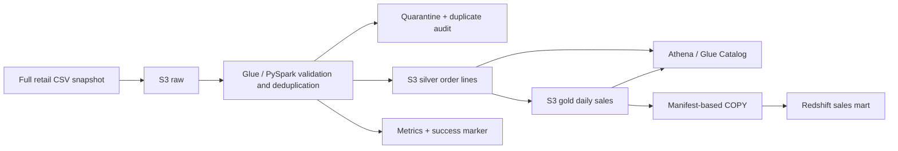

# AWS End-to-End Data Engineering Pipeline

A complete retail analytics project that turns raw CSV order snapshots into validated Parquet datasets and a Redshift sales mart using **Amazon S3, AWS Glue, PySpark, Amazon Athena, and Amazon Redshift**.

The repository includes executable ETL, intentionally imperfect sample data, infrastructure as code, SQL, deployment tooling, tests, and operational documentation. It is designed as a production-style starter with explicit data contracts and safe run publication. Local verification does not replace an acceptance deployment in your AWS account.



## What the project implements

- Strict CSV parsing, explicit schemas, UTC timestamps, decimal money, and row-level validation.
- Deterministic selection of the latest valid order-line version, with rejected rows and superseded versions preserved separately.
- Run-specific silver Parquet partitioned by order date and gold daily sales grouped by date, country, and category.
- A rejected-row quality gate, row reconciliation, structured logging, and a success marker that identifies publishable runs.
- Athena external tables with partition projection, validation SQL, and reporting queries.
- Redshift staging, Parquet COPY manifests, transactional snapshot replacement, and a load audit that protects against duplicate replay.
- CloudFormation for S3, Glue, IAM, Athena, and optional private Redshift Serverless resources.
- A local execution path using the same PySpark transformations as Glue, plus automated tests and CI checks.

**Snapshot contract:** every input batch is a complete current-state snapshot. This project does not implement incremental ingestion or CDC. Sending only new records replaces the reported population with only those records. Cancelled lines remain in silver but do not contribute to gold sales. All sample monetary values use USD.

## Repository layout

```text
.
├── config/                  # Configuration templates without credentials
├── data/
│   ├── raw/                 # Synthetic CSV including intentional defects
│   └── expected/            # Machine-readable sample expectations
├── docs/                    # Architecture, contract, flow, infrastructure, operations
├── glue/                    # Managed Glue job entry point
├── infrastructure/          # CloudFormation template
├── scripts/                 # Package, deploy, and orchestrate AWS runs
├── sql/
│   ├── athena/              # External tables, quality checks, analytics
│   └── redshift/            # Warehouse schema, snapshot load, analytics
├── src/retail_pipeline/      # Shared transformations and runtime support
├── tests/                   # Unit, contract, and Spark integration tests
├── pyproject.toml           # Pinned runtime and development dependencies
├── LICENSE                  # Original MIT license
└── .gitignore               # Original ignore rules
```

Generated packages go to `dist/` and local data/configuration go to `build/`; both are already excluded by the original `.gitignore`.

## Run locally

Install **Python 3.11** and **Java 17**, with `JAVA_HOME` pointing to the Java installation. The Spark dependency is pinned to **3.5.4** to match the deliberately selected **AWS Glue 5.0** runtime. This is an explicit compatibility target, not a claim that it is the newest Glue release. See the [AWS Glue version documentation](https://docs.aws.amazon.com/glue/latest/dg/release-notes.html).

From a terminal in this repository, create and activate a virtual environment:

```bash
python -m venv .venv
```

On Linux/macOS, activate it with `source .venv/bin/activate`. In Windows PowerShell, use `.\.venv\Scripts\Activate.ps1`. Use a Python 3.11 interpreter when creating the environment; `python --version` should report 3.11 afterward. For Spark execution on Windows, WSL2 with Java 17 is the recommended route if the native Hadoop filesystem utilities are unavailable.

```bash
python -m pip install --upgrade pip
python -m pip install -e ".[spark,dev]"
python -m retail_pipeline.local --input data/raw/orders.csv --output-dir build/local --run-id demo-001 --max-reject-ratio 0.40
```

Use a fresh `--run-id` for each attempt, such as `demo-002` on the next run. Existing run output is not overwritten. No AWS credentials or services are required for this local example.

The sample deliberately rejects 8 of 20 records, so the demonstration threshold is `0.40`. For real sources, set a business-approved threshold. Expected successful results:

| Measure | Expected value |
| --- | ---: |
| Input rows | 20 |
| Rejected rows | 8 |
| Superseded valid versions | 2 |
| Current valid silver lines | 10 |
| Completed / cancelled current lines | 9 / 1 |
| Gold date-country-category groups | 7 |
| Completed units | 20 |
| Gross sales | USD 616.50 |
| Discounts | USD 56.00 |
| Net sales | USD 560.50 |

The local runner writes Parquet beneath `build/local/` and successful metrics to `build/local/manifests/demo-001/success.json`. See [sample expectations](data/expected/sample_metrics.json) and [the data contract](docs/data-contract.md) for the rules behind these values.

## Tests and checks

Run the checks after installing the development and Spark extras:

```bash
python -m pytest -q
python -m ruff check .
python -m ruff format --check .
cfn-lint infrastructure/cloudformation.yaml
python -m compileall -q src scripts glue
python scripts/package_glue.py
python -m build
git diff --check
```

Spark-marked tests require Java and Spark. For a fast Python-only subset, use `python -m pytest -q -m "not spark"`; this is not a substitute for the complete suite. Tests exercise malformed inputs, decimal and timestamp validation, duplicates, cancellations, quality thresholds, output contracts, and orchestration behavior using AWS mocks where appropriate. The GitHub Actions workflow runs the repository checks in a Linux environment.

## Deploy to AWS

These commands create billable AWS resources and submit real jobs in the account selected by your credentials. The repository does not contain credentials and does not deploy automatically when cloned or tested. Use an AWS profile, IAM Identity Center session, or role through the standard SDK credential chain. Set `AWS_PROFILE` in your shell if you need a named profile.

1. Copy `config/dev.example.json` to `build/dev.json`. Create `build/` first if needed. Review the Region, stack name, project name, environment, and reject threshold. Keep local configuration in `build/` to preserve the existing ignore rules.
2. Review [infrastructure requirements and IAM responsibilities](docs/infrastructure.md). The deployment identity needs CloudFormation and permissions to create the resources in the template, including IAM role creation and passing roles to the services.
3. Deploy the stack and upload the Glue artifacts:

```bash
python scripts/deploy.py --config build/dev.json
```

The deploy command builds `dist/retail_pipeline.zip`, creates or updates the CloudFormation stack, and uploads the shared package and Glue job entry point. Stack outputs provide the generated data bucket, Glue job, catalog database, Athena workgroup, and Redshift COPY role.

4. Upload and process the sample snapshot, then run Athena validation:

```bash
python scripts/run_pipeline.py --config build/dev.json --batch-date 2026-01-15 --input data/raw/orders.csv
```

The runner generates a fresh run identifier, uploads the sample under its raw batch-date prefix, starts Glue, waits for completion, verifies publication, creates the Athena tables, and runs reconciliation SQL. It refuses to overwrite an existing raw batch prefix. To reprocess an already uploaded batch, omit `--input`; use a fresh pipeline run identifier, generated automatically unless you supply `--run-id`.

5. To include Redshift, configure one of these options before the run:

- Set `deploy_redshift` to `true`, supply existing private subnet and security-group identifiers in the config, and rerun deployment. See [the infrastructure guide](docs/infrastructure.md) for VPC and Region prerequisites.
- Set `redshift_workgroup` to an existing Redshift Serverless workgroup in the same Region. Associate the stack's COPY role with its namespace and grant your Data API identity the necessary database privileges.

Then add `--load-redshift` to a new run command, or resume the successful lake run without repeating Glue. Replace `RUN_ID_FROM_SUCCESSFUL_RUN` with the identifier printed by the successful command in step 4:

```bash
python scripts/run_pipeline.py --config build/dev.json --batch-date 2026-01-15 --resume-run RUN_ID_FROM_SUCCESSFUL_RUN --load-redshift
```

This verifies the successful run and its batch identity, repeats Athena reconciliation, initializes the warehouse tables, and loads gold through the Redshift Data API. `--resume-run` cannot be combined with `--input` or `--run-id`. It also supports recovery when Glue succeeded but a later Athena or Redshift step failed. Redshift loading is optional so the lake can be verified before provisioning warehouse capacity. No database password is stored in the project. After the load, use the checks in `sql/redshift/003_analytics.sql` to compare the warehouse row count and net revenue with the selected run's metrics.

## Published S3 layout

```text
s3://<data-bucket>/
├── raw/batch_date=<YYYY-MM-DD>/
├── silver/order_lines/run_id=<run-id>/data/order_date=<YYYY-MM-DD>/
├── gold/daily_sales/run_id=<run-id>/data/
├── quarantine/run_id=<run-id>/data/
├── audit/duplicates/run_id=<run-id>/data/
├── manifests/<run-id>/         # started.json, redshift.json, success.json or failure.json
├── artifacts/                 # Glue entry point and retail_pipeline.zip
├── query-results/
└── temp/
```

Read only runs with a published success marker. A failed job can leave diagnostic or partial objects; their existence does not make a run valid. Athena queries must filter a selected successful `run_id` because each run is a full snapshot. The COPY manifest lists only that run's gold Parquet objects, with their content lengths, and must not be replaced with a prefix covering multiple runs.

The [Athena SQL](sql/athena/) and [Redshift SQL](sql/redshift/) are templates rendered by the runner. `${database}`, `${bucket}`, `${run_id}`, and other placeholders must be resolved before manual execution; Athena location templates contain escaped placeholders that the renderer preserves. Do not paste unrendered templates directly into query editors.

## Operations and limitations

Use a new run identifier for each attempt. Inspect quarantine and logs after quality failures, and keep consumers on the prior successful snapshot until a replacement passes validation. Redshift loads stage and replace the current mart within a transaction, and a committed run identifier cannot be applied twice. A rollback to an older source snapshot therefore uses a new ETL run identifier.

This starter does not provide streaming ingestion, incremental CDC, multi-currency conversion, a continuous production schedule, or organization-specific alert routing. Before production use, verify source completeness, IAM and network policies, load volumes, retention, recovery, and reconciliation in the intended AWS account. Resource costs continue until resources and retained data are cleaned up; consult [operations and cleanup](docs/operations.md).

## Documentation

- [Architecture and design decisions](docs/architecture.md)
- [Step-by-step data flow](docs/data-flow.md)
- [Input and output data contract](docs/data-contract.md)
- [Infrastructure and deployment requirements](docs/infrastructure.md)
- [Monitoring, recovery, and cleanup](docs/operations.md)
- [Sample data notes](data/README.md)

## License

MIT. The original [LICENSE](LICENSE) and `.gitignore` are preserved.
