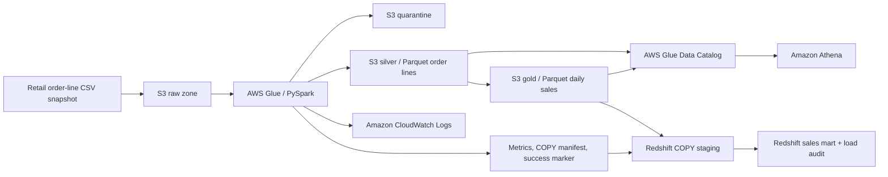

# Architecture

This project processes a retail order-line snapshot into a validated data lake and a queryable sales warehouse. It demonstrates a production-style batch design: explicit contracts, isolated runs, quarantine, data-quality gates, structured logs, infrastructure as code, and repeatable loading. An AWS account deployment and workload-specific security, scale, and recovery testing are still required before operating it as a production service.

## Components

| Component | Responsibility |
| --- | --- |
| Amazon S3 | Preserve the raw snapshot and store run-specific silver, gold, quarantine, and control artifacts. |
| AWS Glue | Execute the shared PySpark transformation using a configured IAM role. |
| Glue Data Catalog | Publish stable table definitions for Athena without scanning data through a crawler. |
| Amazon Athena | Query a selected, validated snapshot directly from Parquet in S3. |
| Amazon Redshift | Load the selected gold snapshot into a warehouse table for SQL reporting. |
| CloudWatch | Collect Glue execution logs and job telemetry. |
| Python tooling | Package code, run local verification, and orchestrate explicitly requested AWS steps. |

The runtime is deliberately pinned to **Glue 5.0, Spark 3.5.4, Python 3.11, and Java 17**. This is a compatibility baseline, not a claim that Glue 5.0 is the newest release. Review the [AWS Glue version matrix](https://docs.aws.amazon.com/glue/latest/dg/release-notes.html) before upgrading, then rerun both local tests and an AWS acceptance run.

## Data model

The input grain is one order line, identified by `(order_id, line_id)`. A snapshot may contain multiple versions of a line; the transformation applies the documented precedence rules to select the current version. The silver layer retains valid current order lines. The gold layer groups completed sales by order date, country, and category.

Each batch is a **complete current-state snapshot** of the source population. Gold is rebuilt from that snapshot, and Redshift replaces its current sales mart from the selected successful gold run. The implementation does not maintain incremental state, perform CDC merges, or infer a complete snapshot from a day's delta. See [the data contract](data-contract.md) before substituting another source.

## Run isolation and publication

Each attempt receives a fresh `run_id`. Its outputs live below that identifier, so a failed attempt cannot overwrite another successful snapshot. A success marker is the publication signal only after the ETL finishes writing the required artifacts and passes its quality checks. Consumers must select a run that has this marker; the presence of Parquet files alone is not proof of success.

Athena uses partition projection, including an injected `run_id`. Every query must supply a literal run identifier predicate. Projection avoids a partition-discovery crawler, but it does not enforce the success marker: the orchestration and operator must validate publication before querying. See [Athena injected projection](https://docs.aws.amazon.com/athena/latest/ug/partition-projection-supported-types.html).

Redshift uses a generated manifest containing the exact gold files and their content lengths. It loads a staging table before replacing the current target snapshot and recording the run in an audit table. Keep the S3 bucket and Redshift database in the same AWS Region, and preserve the gold Parquet column order because [Redshift columnar COPY](https://docs.aws.amazon.com/redshift/latest/dg/copy-usage_notes-copy-from-columnar.html) maps columns positionally.

## Security boundaries

The repository stores configuration templates and resource identifiers, never credentials. Authenticate with the AWS SDK credential chain, such as an IAM Identity Center profile or an assumed IAM role. S3 access is scoped to the provisioned bucket and relevant prefixes; the infrastructure enables encryption and blocks public access. The Glue execution identity, the Redshift S3 read identity, and the deployment/operator identity serve different purposes.

For account-specific requirements, evaluate customer-managed encryption keys, Lake Formation governance, VPC endpoints, centralized audit logs, organization policies, sensitive-data handling, and deployment approval boundaries. These are deployment decisions rather than properties inferred from a successful local test.

## Deliberate limits

- The supplied data is small, synthetic retail data with no external ingestion dependency.
- One configured currency is assumed across all rows; no foreign-exchange conversion is implemented.
- Cancelled lines remain available in silver but do not contribute to gold sales.
- Run isolation provides safe publication; it is not a distributed transaction spanning S3, Athena, and Redshift.
- The project does not install a continuous schedule, streaming ingestion, CDC, dashboards, or an enterprise incident-management service.
- Snapshot retention, source reconciliation, backup policies, expected volumes, and availability objectives must be agreed before production operation.

Use [infrastructure](infrastructure.md) for resource details and [operations](operations.md) for verification and recovery.
