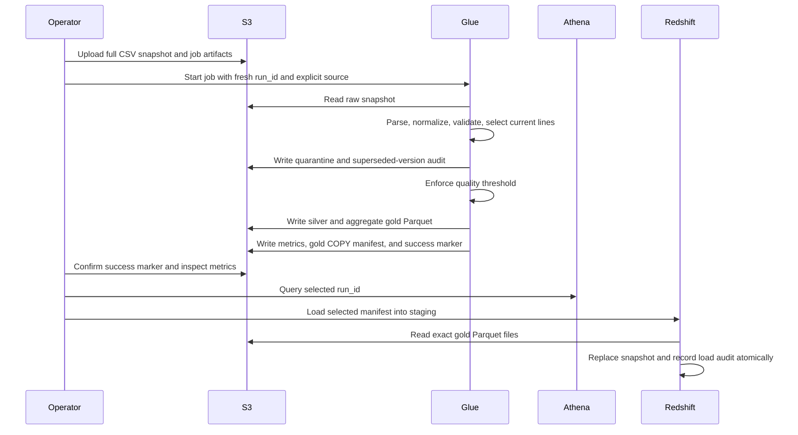

# Data flow

## Processing sequence

1. **Land the source.** Upload an immutable, complete CSV snapshot to the raw prefix for its batch date. The batch date identifies ingestion; it is not a filter on order dates.
2. **Start an isolated attempt.** Pass the raw URI, output bucket/prefix configuration, and a fresh run identifier to Glue. The same transformation package supports local verification.
3. **Read without inferring business types.** Load the defined CSV columns as source values and explicitly parse numbers, amounts, timestamps, and statuses. This makes validation repeatable across batches.
4. **Validate and quarantine.** Separate invalid rows with reasons. A failed run must not be treated as complete merely because some files exist.
5. **Select current versions and gate.** Resolve valid duplicate business keys deterministically according to the contract. Write rejected rows and superseded valid versions separately, reconcile all input rows, and enforce the rejected-row threshold before writing silver.
6. **Write silver.** Preserve the normalized current order lines in compressed Parquet, with order-date partitions inside the run directory.
7. **Write gold.** Aggregate eligible sales into daily country/category measures. Cancelled lines do not contribute to the sales totals.
8. **Publish control artifacts.** Save quality metrics and a Redshift manifest, then write the success marker after successful completion.
9. **Query the lake.** Create the Athena tables and execute queries with the selected `run_id` predicate. Add an `order_date` predicate to silver queries when appropriate to reduce scanning.
10. **Load the warehouse.** Read the chosen gold manifest into staging, validate/load the snapshot, replace the current mart in a transaction, and record its run identifier.

## Snapshot semantics

A raw file represents the complete population of order lines intended for the mart. A corrected line can replace an older version within that input snapshot. An absent line is absent from the next full snapshot, and the warehouse replacement removes the corresponding contribution. Sending only new orders would produce a mart containing only those orders; incremental ingestion is not implemented.

The silver and gold run paths are immutable publication units. Run a retry with a new identifier after correcting the cause of failure. Keep the previous successful identifier available until the new run has passed validation and consumers have switched to it.

## Consumer rules

- Read control artifacts before selecting a snapshot. Do not select a run by lexical order of UUIDs or by the presence of a data directory.
- Scope Athena queries to one completed run unless intentionally comparing snapshots. Combining multiple snapshots counts the same business records more than once.
- Load Redshift from the exact manifest produced for the selected completed run, not from a broad S3 prefix containing multiple runs.
- Preserve the gold schema and column order across PySpark, Athena, and Redshift. Treat a schema change as a coordinated migration.
- Compare the selected run's quality metrics, Athena results, and warehouse aggregates as part of deployment acceptance.

See [the data contract](data-contract.md) for fields and validation rules and [operations](operations.md) for failure handling.
